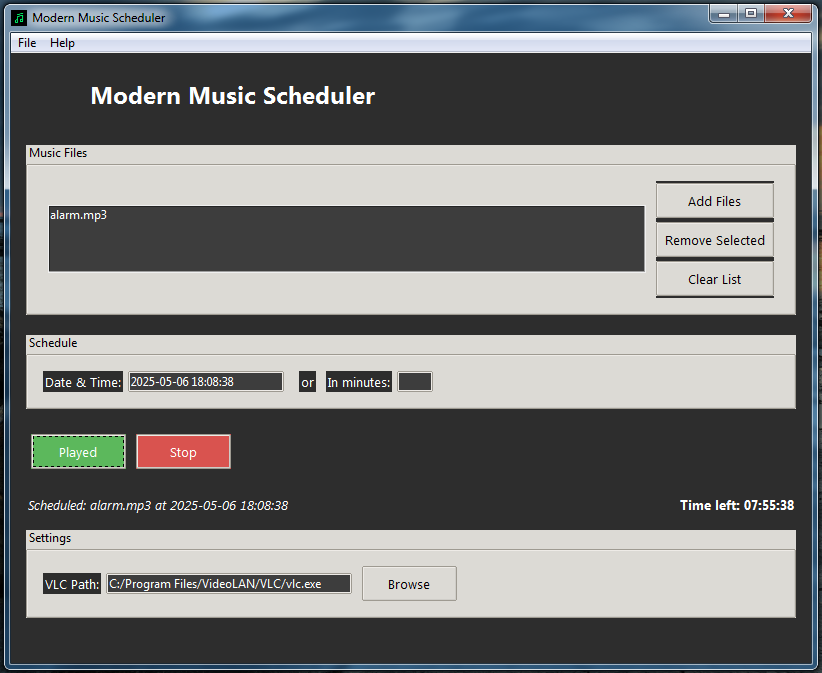

# Modern Music Scheduler



## Program Description

Modern Music Scheduler is an advanced program for scheduling music playback on your computer. It allows users to set up a playlist with various audio files, specify delays or exact times for playback, and manage multiple tracks seamlessly. The application integrates with VLC Media Player for reliable audio playback and features a modern, user-friendly graphical interface.

## Features

- Add and manage a list of music files
- Schedule playback at a specific time or after a delay
- Create playlists for continuous playback of multiple tracks
- Automatic countdown to start playback
- Configure the path to VLC Media Player
- Save and load settings and playlists from a configuration file
- Easy editing and clearing of the playlist
- Modern graphical interface with a sleek design

## Requirements

- Python 3.x
- Tkinter library
- Pillow (PIL) for handling icons and graphics
- VLC Media Player (latest version recommended)

## Installation Instructions

1. Install Python 3.x from [python.org](https://www.python.org/).
2. Install Pillow library:
   ```bash
   pip install pillow
   ```
3. Download and install VLC Media Player from [videolan.org](https://www.videolan.org/).
4. Ensure the VLC path is correctly configured in the program (auto-detected or manually set).

## How to Use

1. Launch the program.
2. Add music files by clicking "Add Files".
3. Select the playback time—either enter the exact date and time or set a delay in minutes.
4. Click "Schedule Playback" to start the countdown; playback will begin automatically at the scheduled time.
5. To stop playback, click "Stop".
6. Save or load settings manually or automatically as needed.

## Notes

- The program uses VLC for playing music files.
- Make sure the VLC path is correct, especially if you use a custom installation.
- Scheduling and countdown functions operate based on your system clock.

Compiling to an executable file
To compile the program into a stand-alone .exe file (Windows):

- Requirements for compilation:
    
    ```bash
    pip install nuitka

To compile the program into a stand-alone .exe file (Windows):

- Run command:

    ```bash
    nuitka --onefile --standalone --follow-imports --windows-console-mode=disable --windows-icon-from-ico=mms.ico --include-data-files=C:\Path\to\icon\mms.ico=mms.ico --enable-plugin=tk-inter --enable-plugin=pylint-warnings mms.py


